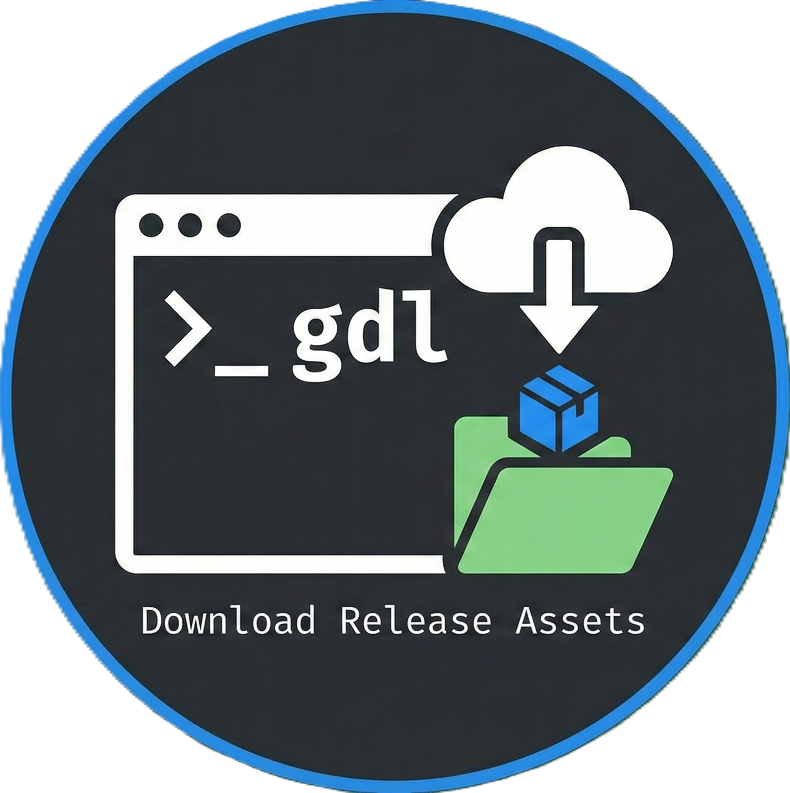

`gdl` is a command-line tool that downloads prebuilt executable binaries from GitHub release pages, automatically matching the host platform (OS and architecture). It supports filtering, unpacking compressed archives, and installing the binary to the current directory.

## Features

- Automatic platform detection (OS: Windows, Linux, macOS; Arch: x86_64, aarch64)
- Flexible asset matching with synonyms (e.g., "win" for Windows, "amd64" for x86_64)
- Stop-words filtering to exclude unwanted assets (replaces previous "blacklist" terminology)
- Interactive selection: `--choose-asset-file` to present all release assets in a TTY for manual selection, and `--choose-bin-file` to choose which extracted file becomes the final binary (both require a TTY and error in non-interactive environments)
- Deterministic binary selection priority: `.exe` suffix (case-insensitive) → Unix execute permission → largest file; ties broken by lexical order
- Sets POSIX execute permission bits on saved binaries when running on Linux/macOS
- Progress bar displayed during downloads (uses `tqdm`)
- Unpacking of ZIP and TAR.GZ archives
- Secure extraction with filters to prevent malicious archive issues
- HTTP redirect handling

## Usage

```bash
# stable release (recommended)
uvx gdl [OPTIONS] REPO

# install and run the latest code directly from GitHub
uvx git+https://github.com/lucidfrontier45/gdl [OPTIONS] REPO
```

### Arguments

- `REPO`: GitHub repository in the format `owner/repo` (e.g., `microsoft/vscode`)

### Options

- `--tag TEXT`: Specific release tag (defaults to latest)
- `--os TEXT`: Override host OS (windows, linux, macos)
- `--arch TEXT`: Override host architecture (x86_64, aarch64)
 - `--stop-words TEXT`: Words to exclude from asset names (can be specified multiple times)
- `--help`: Show help message
- `--no-decompress`: Save downloaded file without extracting/decompressing it
- `-b, --bin-name TEXT`: Specify the final executable filename (defaults to repository name; `.exe` is added on Windows when appropriate)
- `-d, --dest PATH`: Destination directory for saved file or extracted binary (defaults to `.`). Directory is created if needed.
- `-l, --list`: List available release versions for the specified repository and exit (exposed as `list_version` in the CLI data model)

- `--choose-asset-file`: When provided (in a TTY) list all release assets and prompt the user to pick one; ignores OS/arch/stop-word filters. In non-TTY environments this flag causes a clear error. Not compatible with `--list`.
- `--choose-bin-file`: When provided (in a TTY) prompt the user to choose which extracted candidate file is the final binary; in non-TTY environments this flag causes a clear error.

### Examples

Download the latest release binary for the host platform:

```bash
uvx gdl microsoft/vscode
```

Download a specific tag:

```bash
uvx gdl microsoft/vscode --tag 1.80.0
```

Override platform:

```bash
uvx gdl microsoft/vscode --os linux --arch x86_64
```

Exclude debug builds:

```bash
uvx gdl microsoft/vscode --stop-words debug --stop-words test
```

## Platform Support

- **OS**: windows (synonyms: win32), linux, macos (synonyms: mac, darwin)
- **Arch**: x86_64 (synonyms: x64, amd64), aarch64 (synonyms: arm64)

## Requirements

- Python 3.13+
- httpx
- tyro
- tqdm
